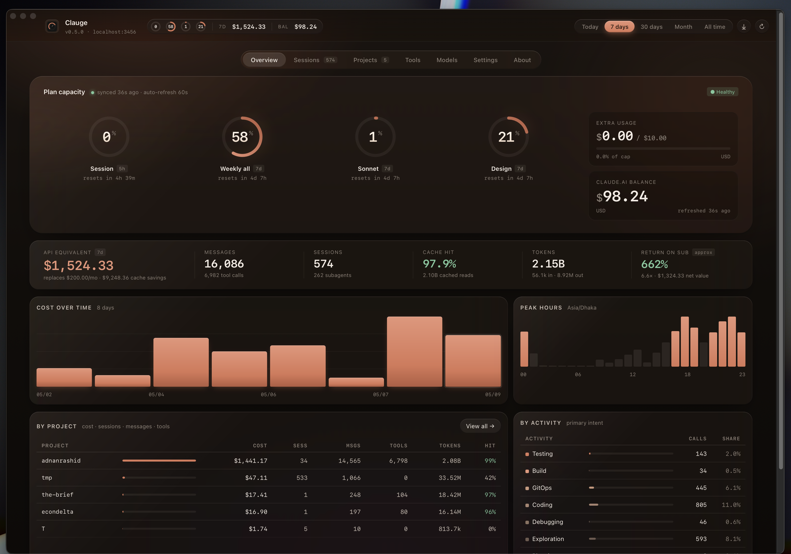
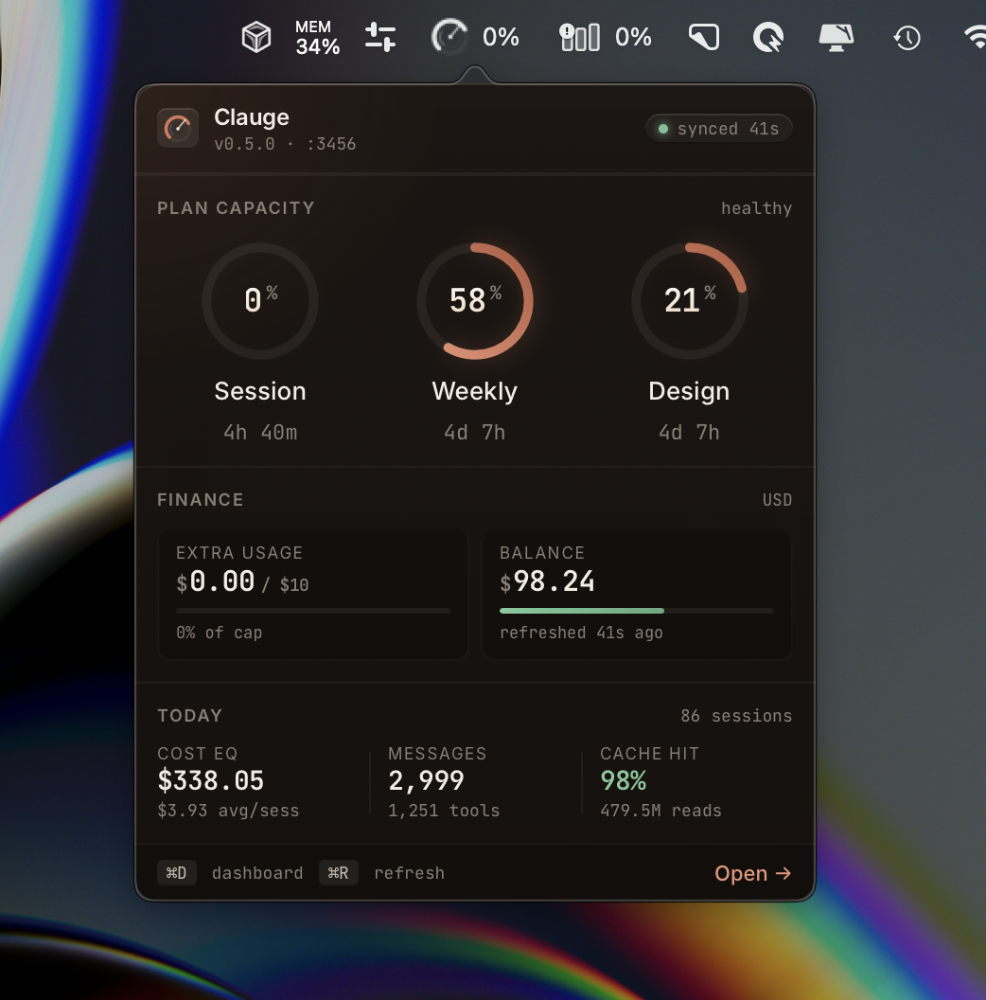

<p align="center">
  
</p>

<h1 align="center">Clauge</h1>

<p align="center">
  Token analytics and subscription value dashboard for <strong>Claude Code</strong> + <strong>claude.ai</strong>.<br/>
  Local Node.js + HTML, <code>npx</code>-installable. Browser extension auto-syncs claude.ai plan usage.
</p>

<p align="center">
  <a href="https://www.npmjs.com/package/clauge"></a>
  <a href="LICENSE"></a>
</p>



<p align="center">
  
</p>

> Status: **V3 — native macOS app** (universal Apple Darwin DMG, signed auto-updater) plus the existing `npx clauge` browser dashboard. v0.7.x ships a guided first-launch wizard for macOS Keychain access, an in-memory keychain cache (one prompt per launch instead of every poll), and an in-app **↻ Restart Now** button so auto-updates actually take effect on click.

## Install

Three steps to a working setup: install the app, install the browser extension (optional but recommended for full claude.ai data), stay signed in to claude.ai.

### Step 1 — Install the app

**Option A — Native macOS app (recommended for the v3 menu-bar experience):**

Download the latest universal DMG from [Releases](https://github.com/clauding-lab/clauge/releases/latest), drag `Clauge.app` to Applications, and launch.

The app sits in your menu bar:
- **Left-click** the menu-bar icon → glanceable popover (Plan Capacity rings + Finance + Today)
- **Right-click** → Open Dashboard / Preferences / Check for Updates / Quit
- **Auto-updates** from gh-pages on every launch. When a new version downloads, click **↻ Restart Now to apply vX.Y.Z** in Settings → Updates (or wait for the macOS notification). v0.7.3+ also self-heals across updates: if the previous version's sidecar is still running, the new launch detects the version mismatch and evicts it before adopting a fresh one.

#### First launch — the Welcome wizard

A 4-step Welcome wizard explains the one permission Clauge needs: read access to your Claude Code OAuth credentials in macOS Keychain. Walk through:

1. **Welcome** — what Clauge does
2. **macOS Keychain Access** — sets expectations for the system prompt that's about to fire
3. **Other Permissions** — Notifications, Launch at Login, optional claude.ai sign-in
4. **Ready to Connect** — click **Connect ✓** (or **Skip for now**)

On Connect, macOS shows its standard Keychain prompt:

> "Clauge wants to use your confidential information stored in 'Claude Code-credentials' in your keychain."

Click **Always Allow**. The wizard closes and the dashboard appears with your data. Clauge never sees your Anthropic password, API key, or session token — it just reads the OAuth blob Claude Code itself wrote to your Keychain.

> **Note for v0.7.x DMG flavor:** the build ships ad-hoc-signed (no Apple Developer ID yet — coming in v0.8.0 with the Mac App Store flavor). macOS Keychain can't durably remember "Always Allow" without a stable code-signing identity, so the prompt may reappear on each launch. The wizard's Step 2 explains this; v0.8.0 fixes it permanently. v0.7.2's in-memory cache means it only fires once per launch (down from once per 30s poll in older builds), and the **↻ Refresh** button next to the Claude Code row in Settings → Connections lets you re-trigger the read on demand (e.g., after running `claude /login` to rotate your token).

If you click **Skip for now** instead, the dashboard appears immediately with Claude Code shown as "Not Installed". Click the **↻ Refresh** button on that row whenever you're ready to grant Keychain access — same Always Allow prompt fires.

**Option B — Browser dashboard via npx (Linux, headless servers, or no-desktop-app preference):**

```bash
npx clauge
```

Launches a Hono server at **http://localhost:3456**. Same data model as the native app — pick whichever surface fits your workflow.

Either path reads from `~/.claude/projects/` (where Claude Code writes its session logs). **No sign-in needed for Claude Code data — it's already on your disk.** If you've ever used Claude Code on this machine, your dashboard populates immediately on first open.

### Step 2 — Install the Clauge Sync browser extension (optional, recommended)

Step 1 covers Claude Code (CLI) data. To also see your **claude.ai plan usage and prepaid balance** in the dashboard, install the Clauge Sync browser extension. It runs in your already-authenticated claude.ai tab and syncs your plan numbers to your local Clauge once a minute.

**Install from Chrome Web Store (recommended):**

→ [Clauge Sync on the Chrome Web Store](https://chromewebstore.google.com/detail/clauge-sync/ailfbgegpplecgcadlkplkllobepfcga)

Click "Add to Chrome." Works on Chrome, Edge, Brave, Arc, and any other Chromium-based browser.

**Manual install (developer mode — only needed if you can't use the Web Store):**

1. Clone this repo: `git clone https://github.com/clauding-lab/clauge.git`
2. Open `chrome://extensions` in your browser
3. Toggle **Developer mode** (top-right corner)
4. Click **Load unpacked** and pick the `extension/` folder from this repo

After install, pin the Clauge Sync icon to your toolbar so you can see sync status at a glance. Click the icon any time to force an immediate sync. Right-click → **Options** to change port or polling interval.

### Step 3 — Sign in to claude.ai (and stay signed in)

The extension uses your **existing claude.ai browser session** — it never asks you for an Anthropic API key, password, or token. Just:

1. Open [claude.ai](https://claude.ai) in the same browser profile where you installed the extension
2. Sign in with your Anthropic account as you normally would
3. Stay signed in (don't sign out, don't run claude.ai in incognito mode unless you explicitly enable the extension in incognito)

The extension polls `claude.ai/api/organizations/{uuid}/usage` once a minute *while you have an active claude.ai session* and POSTs the snapshot to your local Clauge dashboard. If you sign out of claude.ai, the extension goes quiet until you sign back in.

## How Clauge gets your data

Clauge has **no login screen, no API key field, no Anthropic auth flow**. It is fundamentally different from a SaaS app.

Think of it less like Notion / Linear / Slack (where you sign in to *their* server) and more like **Activity Monitor** or a **bash-history viewer** — a *reader* over data your other tools have already written to your machine. There's no remote service to authenticate against, so there's nothing to "sign in" to.

### Two data sources, both auth-free

| Source | What it covers | Where it comes from | Auth needed |
|---|---|---|---|
| Claude Code CLI logs | Per-session token usage, costs, models, tools, projects | `~/.claude/projects/**/*.jsonl` written by Claude Code itself | None — file-system access only |
| claude.ai plan data | Plan rings (Session/All/Sonnet/Opus), prepaid balance, billing cap | Clauge Sync browser extension running in your claude.ai tab, riding your existing browser cookies | Your normal claude.ai login — Clauge never sees your password |

The extension hitchhikes on **your** already-authenticated claude.ai session. Anthropic sees a request from your browser (where you're already signed in). Clauge sees an HTTP POST to its own port. **Clauge never holds an Anthropic API key, password, or session token.**

This is the architectural elegance: nothing to leak, nothing to rotate, nothing to phish. It also means Clauge is **strictly local** — your usage data never leaves your machine. (Privacy policy: [docs/PRIVACY.md](docs/PRIVACY.md).)

### What this means in practice

- **No account creation, no Anthropic credentials.** A 4-step first-launch wizard (v0.7.2+) explains the one macOS Keychain permission Clauge needs to read Claude Code's OAuth blob. It never asks for an account, password, or API key. After **Connect**, your data appears immediately — provided you've used Claude Code on this machine.
- **No accounts, no plans, no passwords held by Clauge.** Compromise the binary, you compromise nothing about your Anthropic identity.
- **No telemetry.** Clauge never phones home — Clauding-Lab does not know you exist.
- **The extension is optional.** The dashboard works fine without it; you just won't see claude.ai plan-ring data (the Claude Code CLI metrics are unaffected).

## What it does

### Claude Code analytics (from local JSONL)

- **Per-session tracking** — tokens, cost, model, cache hit, primary task type
- **Per-project breakdown** — cost · sessions · messages · tools · tokens · hit %
- **Per-model cost split** — Opus / Sonnet / Haiku, each with cache hit rate
- **Task classification** — Coding / Debugging / Testing / Planning / Git Ops / Build / Exploration / Conversation (heuristic, deterministic)
- **Cache analytics** — corrected hit-rate formula and **net cache savings** (subtracts cache-write overhead, distinguishes 5-minute vs 1-hour cache tiers)
- **Tool / shell / MCP analytics** — what Claude Code actually does
- **Peak hours** — UTC hourly distribution of calls and cost
- **Subscription value** — how much retail API spend your subscription replaces, with honest framing
- **Period filtering** — Today / 7d / 30d / Month / All Time
- **Project filter** — case-insensitive substring match
- **Export** — CSV and JSON for any period + project filter

### claude.ai plan tracking (via browser extension)

- **5 ring gauges** — Session (5h), All models (7d), Sonnet (7d), Opus (7d), Claude Design — green/amber/red by 60/85% thresholds, with reset countdowns
- **Extra-usage card** — your billing cap with progress bar
- **Auto-refresh every minute** via the [Clauge Sync](https://chromewebstore.google.com/detail/clauge-sync/ailfbgegpplecgcadlkplkllobepfcga) browser extension; the dashboard polls the local store and updates the gauges in place

### From source

```bash
git clone https://github.com/clauding-lab/clauge.git
cd clauge && npm install && cp .env.example .env
node server.js
```

Set `NO_OPEN=1` to skip the auto-open. Set `CLAUDE_DIR=~/somewhere-else` to read from a non-default location.

## Why claude.ai data needs the extension (background)

claude.ai sits behind Cloudflare's bot challenge, so a plain server-side `fetch` from Clauge cannot reach claude.ai's API directly — the request would be challenged or blocked. The extension solves this by running *inside* your already-authenticated browser tab, where Cloudflare sees you as the legitimate user. The extension's only job: fetch usage from your own session and POST the snapshot to your local Clauge.

This is also why there's no "API key field" anywhere in Clauge. There's no API key flow available to third parties for the personal-plan claude.ai endpoints — the only legitimate caller is the user's own browser. The extension is the well-behaved equivalent of "the user manually checking their plan page once a minute."

## How it works

```
~/.claude/projects/{path-encoded-dir}/{session_uuid}.jsonl
    │
    ▼                                 ┌────────────────────────┐
JSONL stream parser (lib/parser.js)   │  Browser extension     │
    │  dedups assistant turns by      │  (or bookmarklet)      │
    │  .requestId                     │  reads claude.ai usage │
    ▼                                 │  with user's cookies   │
Per-turn extractor → aggregator       └────────────┬───────────┘
    │                                              │
    └──────────────► Hono REST API ◄───────────────┘
                            │
                            ▼
                     HTML dashboard
                     (http://localhost:3456)
```

**The single most important invariant:** Claude Code emits 1–3 JSONL lines per assistant request (one per content-block type: thinking / text / tool_use), each with **identical** `usage` numbers. The parser dedups by `requestId` — without this, every cost is multiplied 2-3×. See `lib/parser.js` and `test/parser.test.js`.

**Pricing:** model rates come from [LiteLLM's `model_prices_and_context_window.json`](https://github.com/BerriAI/litellm/blob/main/model_prices_and_context_window.json) (cached locally for 24h, with a bundled offline fallback). Two-tier cache writes (`ephemeral_5m` vs `ephemeral_1h`) are priced separately. The `costUSD` field is never read — cost is always recomputed so rate-preset changes propagate to history.

**Subscription value framing:** the headline number tells you how much retail API spend your subscription replaces *at observed token usage*. It does **not** tell you whether your plan is worth keeping — most users would cut back if they paid retail rates. Card copy includes this caveat.

## Configuration

`.env` (optional — copy from `.env.example`):

```
PORT=3456                 # dashboard port
CLAUDE_DIR=~/.claude      # source directory
SUBSCRIPTION_COST=200     # for the API replacement value calc

# Per-1M-token rate fallbacks for models LiteLLM doesn't have
RATE_INPUT=3.00
RATE_OUTPUT=15.00
RATE_CACHE_READ=0.30
RATE_CACHE_CREATE=3.75
RATE_CACHE_CREATE_1H=6.00
```

## Development

```bash
npm test          # 113 unit tests via Node's built-in test runner
npm run dev       # auto-restart server on changes
npm start         # plain start
```

## API

| Endpoint | Returns |
|---|---|
| `GET /api/summary?period=7d&project=X` | totals, primary model, message/tool/subagent counts |
| `GET /api/sessions?period=7d` | list of session summaries |
| `GET /api/sessions/expensive?limit=5` | top-N most expensive sessions |
| `GET /api/sessions/:id` | one session summary |
| `GET /api/projects?period=7d` | per-project rollup |
| `GET /api/daily?period=30d` | daily totals + per-project breakdown |
| `GET /api/models?period=7d` | per-model cost + cache hit |
| `GET /api/tasks?period=7d` | task category breakdown |
| `GET /api/tools?period=7d` | core tools / shell commands / MCP servers |
| `GET /api/cache?period=30d` | hit rate + net savings + daily trend |
| `GET /api/hours?period=7d` | 24-hour activity distribution (UTC) |
| `GET /api/roi?period=7d` | API replacement value |
| `GET /api/export?format=csv&period=7d` | CSV / JSON export |
| `GET /api/usage` | latest claude.ai plan-usage snapshot |
| `POST /api/usage/ingest` | extension/bookmarklet target — CORS-restricted to claude.ai + extension origins |
| `GET /api/bookmarklet` | the bookmarklet code as `javascript:` href + readable source |
| `GET /api/health`, `/api/config` | service info |

## What's coming

- **Windows installer (v0.6.0)** — NSIS build via the same Tauri codebase, dashboard-only on Windows. Spec + plan in `docs/superpowers/`.
- **Auto-detect missing extension + first-run install prompt** — detect whether Clauge Sync is installed and, if not, surface a Chrome Web Store install banner in the dashboard on first launch.
- **Intelligence banner** with pace projections (priority rules: extra usage near cap, session reset imminent, weekly-vs-Sonnet routing hints, etc.)
- **One-shot success rate** per task category
- **Per-project drill-down view** with sessions, files edited, tools used
- **Linux build** — separate menu-bar surface design (libappindicator vs Wayland portal) needed before this is real

## Why

Five apps track Claude usage. None provide token-level analytics for Claude Code. None compute subscription value vs API equivalent at observed usage. None tell you what to do about your usage. Clauge does the first two natively, plus pulls claude.ai plan utilisation into the same dashboard so you see Code spend and plan limits side-by-side.

## License

MIT — see [LICENSE](LICENSE). Privacy policy in [docs/PRIVACY.md](docs/PRIVACY.md).

Built by [clauding-lab](https://github.com/clauding-lab).
