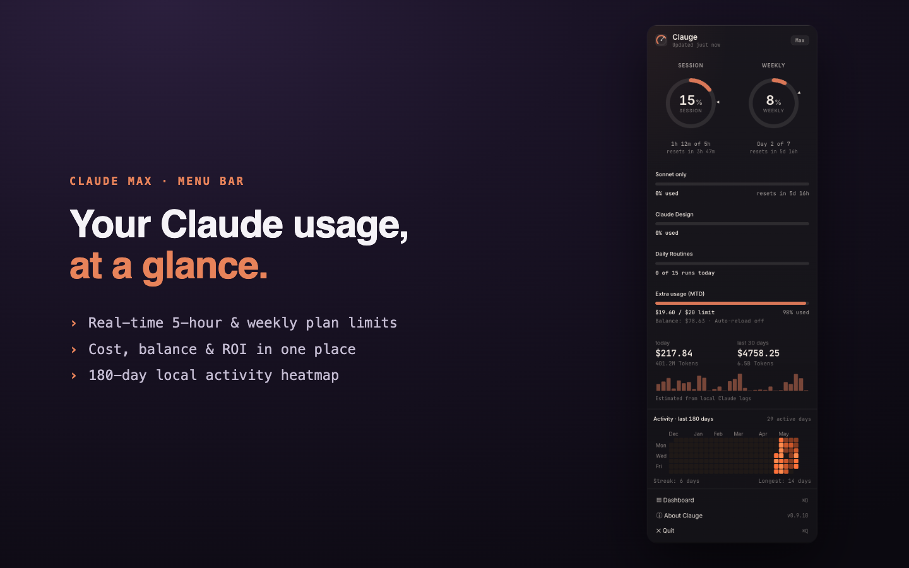
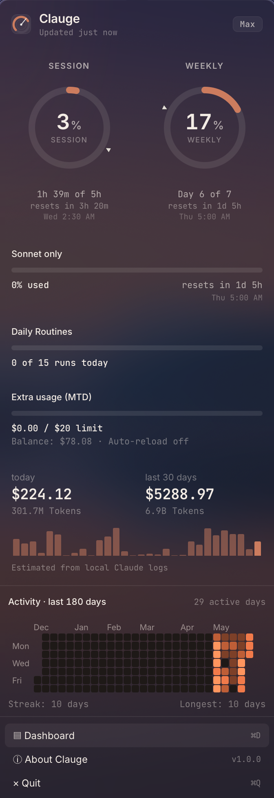
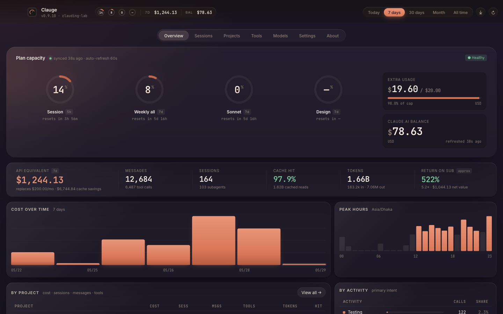

<p align="center">
  
</p>

<h1 align="center">Clauge</h1>

<p align="center">
  <strong>Know what your Claude subscription is actually worth.</strong><br/>
  A native macOS menu-bar app (and Windows desktop app) that turns your local Claude&nbsp;Code logs and claude.ai plan usage into one glanceable dashboard — cost, plan limits, cache savings, and subscription ROI.
</p>

<p align="center">
  <a href="https://apps.apple.com/us/app/clauge/id6770303247"></a>
  <a href="https://apps.apple.com/us/app/clauge-token-analytics/id6777443865"></a>
  <a href="https://github.com/clauding-lab/clauge/releases/latest"></a>
  <a href="https://github.com/clauding-lab/clauge/actions/workflows/check.yml"></a>
  <a href="LICENSE"></a>
</p>



---

Clauge reads usage data your own tools have already written to your machine and presents it as analytics. There is **no login screen, no API key field, and no telemetry** — it is a local reader, closer to Activity Monitor than to a SaaS app. Your usage data never leaves your computer.

- **Claude Code** — token usage, cost, cache savings, models, tools, and projects, parsed from the local session logs at `~/.claude/projects/`.
- **claude.ai** — plan limits (session / weekly / Sonnet), prepaid balance, and overage spend, synced from your signed-in browser tab by the optional [Clauge Sync](https://chromewebstore.google.com/detail/clauge-sync/ailfbgegpplecgcadlkplkllobepfcga) extension.

## Install

### macOS

| Method | Command / link |
|---|---|
| **Mac App Store** *(recommended — sandboxed, auto-updates through the Store)* | [**Download Clauge**](https://apps.apple.com/us/app/clauge/id6770303247) |
| Homebrew | `brew install --cask clauding-lab/tap/clauge` |
| Direct download | Universal DMG from [Releases](https://github.com/clauding-lab/clauge/releases/latest) → drag `Clauge.app` to Applications |

Clauge lives in your menu bar. **Left-click** for the glanceable popover; **right-click** for Dashboard (⌘D), Preferences, Check for Updates, and Quit.

<p align="center">
  
</p>

The popover shows paired **Session** + **Weekly** gauges (each with its local reset time), the **Sonnet** weekly limit, daily routine runs, month-to-date overage and prepaid balance, a 30-day spend chart, and a 180-day activity heatmap.

> **First launch.** A short Welcome wizard explains the one permission Clauge needs on macOS: read access to the OAuth credential Claude&nbsp;Code already stored in your Keychain. macOS will prompt *"Clauge wants to use … 'Claude Code-credentials' …"* — click **Always Allow**. Clauge never sees your Anthropic password, API key, or session token; it reads only the credential blob Claude&nbsp;Code itself wrote. You can skip this and grant it later from **Settings → Connections → ↻ Refresh**.

### iOS

A free, read-only **iPhone companion** — *Clauge - Token Analytics* — that shows your Claude usage at a glance on the go.

| Method | Link |
|---|---|
| **App Store** | [**Download Clauge - Token Analytics**](https://apps.apple.com/us/app/clauge-token-analytics/id6777443865) — iPhone, iOS 17+, free |

### Windows

Download `Clauge_<version>_x64-setup.exe` from [Releases](https://github.com/clauding-lab/clauge/releases/latest) and run it. The installer is **per-user (no admin prompt)** and installs to `%LOCALAPPDATA%\Clauge`.

The Windows build is not yet code-signed, so you'll click through two first-run warnings (Authenticode signing is planned):

1. **Browser download** — Edge/Chrome may flag the `.exe` as "uncommon." Expand the bar → **Keep** (Chrome) or **More info → Keep anyway** (Edge).
2. **SmartScreen on launch** — "Windows protected your PC" → **More info** → **Run anyway**.

Clauge is open source and reproducible from each tagged release, so you can audit or rebuild it yourself. Two notes on the current Windows build: there is **no system-tray icon** (close the dashboard window to quit; relaunch from the Start Menu), and the in-app claude.ai sign-in is **macOS-only** — on Windows, use the [Clauge Sync extension](#browser-extension-for-claudeai-data) for plan data. Auto-updates work the same as on macOS (Settings → Updates → Check Now).

### Linux / headless

```bash
npx clauge   # serves the dashboard at http://localhost:3456
```

The npm package is a legacy browser-dashboard build (no menu bar, no native popover, no auto-updater). Use it for headless or Linux setups; prefer the native apps elsewhere.

> Claude&nbsp;Code analytics need **no sign-in** on any platform — the data is already on disk. If you've used Claude&nbsp;Code on this machine, the dashboard populates on first open.

## Browser extension (for claude.ai data)

The Claude&nbsp;Code metrics work on their own. To also see your **claude.ai plan usage and balance**, install **Clauge Sync** — it runs in your already-authenticated claude.ai tab and posts a usage snapshot to your local Clauge once a minute.

→ **[Clauge Sync on the Chrome Web Store](https://chromewebstore.google.com/detail/clauge-sync/ailfbgegpplecgcadlkplkllobepfcga)** (Chrome, Edge, Brave, Arc, any Chromium browser)

Then just stay signed in to [claude.ai](https://claude.ai) in that browser profile. The extension rides your existing session — **it never asks for an API key, password, or token.** If you sign out, it goes quiet until you sign back in.

*Why an extension?* claude.ai sits behind Cloudflare's bot protection, so a server-side request from Clauge can't reach it. The extension runs *inside* your browser, where Cloudflare already trusts you — the well-behaved equivalent of checking your own plan page once a minute. There is no public API for personal-plan claude.ai usage, which is why Clauge has no API-key flow at all.

## How your data stays private

Clauge holds **no account, no Anthropic credentials, and no session tokens** — so there's nothing to leak, rotate, or phish.

| Source | Covers | Comes from | Auth |
|---|---|---|---|
| Claude&nbsp;Code logs | Per-session tokens, cost, models, tools, projects | `~/.claude/projects/**/*.jsonl` (written by Claude&nbsp;Code) | None — local file read |
| claude.ai plan data | Session/weekly/Sonnet limits, balance, overage | Clauge Sync, riding your browser session | Your normal claude.ai login |

Anthropic sees a request from *your* browser; Clauge sees a local HTTP POST to its own port. No telemetry, no phone-home — Clauding-Lab doesn't know you exist. The full policy is in [PRIVACY.md](PRIVACY.md).

## Features

The dashboard (⌘D, or right-click → Open Dashboard) is the full view — plan capacity, an analytics digest, cost-over-time, and peak hours:

<p align="center">
  
</p>

**Claude Code analytics** (from local logs)

- Per-session tracking — tokens, cost, model, cache-hit rate, primary task type
- Per-project rollup — cost · sessions · messages · tools · hit %
- Per-model cost split (Opus / Sonnet / Haiku) with cache-hit rates
- Task classification — coding / debug / test / plan / git / build / exploration (deterministic)
- Cache analytics — corrected hit rate and **net savings** (5-minute vs 1-hour tiers, minus write overhead)
- Tool / shell / MCP usage, peak-hours distribution, and a 180-day **activity heatmap** with streaks
- **Subscription value** — how much retail API spend your usage would have cost, with honest framing
- Period (Today / 7d / 30d / Month / All) and project filters; CSV / JSON export

**claude.ai plan tracking** (via the extension)

- Live **plan gauges** — Session (5h), Weekly (7d), and Sonnet (7d) — color-coded by usage, each with the **local reset time** beneath its countdown
- Prepaid **balance** and **month-to-date overage** against your cap
- Refreshes about once a minute and updates in place

## Command-line interface

The same binary that backs the dashboard doubles as a CLI — handy for scripting and headless setups.

```bash
clauge config get                              # config as JSON (HTTP-first, falls back to disk)
clauge config providers [--json]               # list providers + enabled state
clauge config enable  --provider claude-ai-session
clauge config disable --provider clauge-sync
echo "$KEY" | clauge config set-api-key --provider anthropic-admin --stdin
clauge --help    |    clauge --version
```

The Mac App bundle ships the CLI at `Contents/Resources/clauge-cli`; symlink it onto your `PATH`, or let the dashboard install the symlink for you. Homebrew installs put `clauge` on `PATH` automatically. `set-api-key` only accepts the key via stdin (never on the command line) and is macOS-only for now.

## Local API (`/v1/usage`)

While Clauge is running, other local tools (statuslines, scripts, dashboards) can read your usage without parsing any logs themselves — a stable, versioned, **loopback-only** JSON API:

```bash
# 1. Find the live port (never hardcode 3456 — it can shift to 3457-3460)
PORT=$(cat ~/Library/Caches/Clauge/active-port)   # Windows: %LOCALAPPDATA%\Clauge\active-port

# 2. Read the snapshot
curl http://127.0.0.1:$PORT/v1/usage          # array of provider snapshots
curl http://127.0.0.1:$PORT/v1/usage/claude   # single snapshot (204 = no data yet)
```

Each snapshot carries `apiVersion`, `providerId`, and a `lines[]` array of typed entries — `progress` lines (Session/Weekly %, with `resets_at`) and `text` lines (Spend, ROI) — so consumers render on `type` + `label` and new lines never break them. The schema is wire-compatible with [aiusage](https://github.com/ahsanhabibakik/aiusage) consumers. Loopback-only by design: the server binds `127.0.0.1` and rejects any request whose `Host` header isn't a loopback name.

## Configuration

Optional `.env` (copy from `.env.example`):

```bash
PORT=3456                 # dashboard port
CLAUDE_DIR=~/.claude      # source directory for Claude Code logs
SUBSCRIPTION_COST=200     # monthly cost used for the API-replacement-value calc

# Per-1M-token fallback rates for models LiteLLM doesn't list
RATE_INPUT=3.00
RATE_OUTPUT=15.00
RATE_CACHE_READ=0.30
RATE_CACHE_CREATE=3.75
RATE_CACHE_CREATE_1H=6.00
```

## How it works

```
~/.claude/projects/<dir>/<session>.jsonl ──► JSONL parser ──► aggregator ──┐
                                                                            ▼
claude.ai usage (via extension, your cookies) ──────────────► Hono REST API
                                                                            │
                                                                            ▼
                                                              dashboard + menu-bar UI
```

- **Dedup invariant:** Claude&nbsp;Code emits 1–3 JSONL lines per assistant request (one per content block) with identical `usage` numbers; the parser dedups by `requestId`. Without it, every cost is 2–3× too high.
- **Pricing:** model rates come from [LiteLLM](https://github.com/BerriAI/litellm/blob/main/model_prices_and_context_window.json) (cached 24h, with a bundled offline fallback), with 5-minute vs 1-hour cache tiers priced separately. The `costUSD` field in the logs is never trusted — cost is always recomputed.
- **Local only:** the sidecar binds to `127.0.0.1`; read endpoints are restricted to the app's own loopback origins, and the app only ever trusts a sidecar it launched itself.

### API

The local server (`http://localhost:3456`) exposes a small read API — `GET /api/summary`, `/sessions`, `/sessions/expensive`, `/sessions/:id`, `/projects`, `/daily`, `/models`, `/tasks`, `/tools`, `/cache`, `/hours`, `/roi`, `/activity`, `/usage`, `/export`, `/bookmarklet`, `/health`, `/config` — plus two writes: `POST /api/usage/ingest` (the extension target, origin-restricted to claude.ai + extension origins) and `POST /api/config/providers/:name` (the provider toggle the CLI uses).

## Development

```bash
git clone https://github.com/clauding-lab/clauge.git
cd clauge && npm install
node server.js        # run the dashboard locally (NO_OPEN=1 to skip auto-open)

npm test              # Node test runner
npm run dev           # auto-restart on changes
npm run check         # full CI gate: validators + cargo fmt + clippy + cargo test + npm test
```

The native shell is [Tauri 2](https://tauri.app) (`src-tauri/`); the dashboard/popover are served by a Node sidecar bundled as a single executable. See [AGENTS.md](AGENTS.md) for build/release conventions and [CHANGELOG.md](CHANGELOG.md) for version history.

## Roadmap

- **Code signing** — DMG notarization (macOS) and Authenticode (Windows) to remove the unidentified-developer / SmartScreen warnings on the direct-download builds.
- **claude.ai sign-in on Windows** — native OAuth parity with macOS (Windows currently relies on the extension for plan data).
- **Linux build** — needs a dedicated menu-bar / tray surface design.
- **Pace projections** — reset-aware guidance (approaching cap, session reset imminent, weekly-vs-Sonnet routing).

## Why Clauge

Plenty of tools track Claude usage, but none give **token-level analytics for Claude&nbsp;Code**, and none compute what your **subscription is worth versus retail API pricing** at your real usage. Clauge does both natively and puts your Claude&nbsp;Code spend and claude.ai plan limits side by side.

## Contributing & security

- Patches: see [CONTRIBUTING.md](CONTRIBUTING.md) — commit style, `npm run check`, and where issues go.
- Found a vulnerability? See [SECURITY.md](SECURITY.md) — please don't open a public issue.

## License

MIT — see [LICENSE](LICENSE). Built by **Adnan Rashid** · Copyright © 2026 Adnan Rashid.
