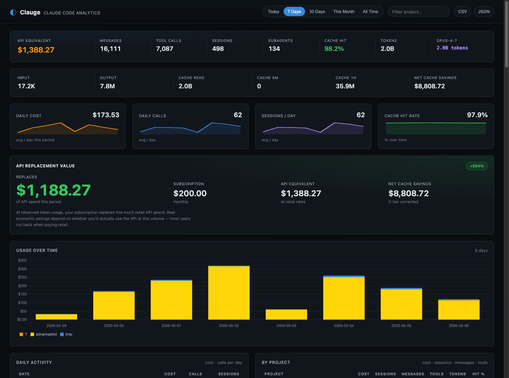

<p align="center">
  
</p>

<h1 align="center">Clauge</h1>

<p align="center">
  Token analytics and subscription value dashboard for <strong>Claude Code</strong>.<br/>
  Local Node.js + HTML, <code>npx</code>-installable.
</p>

<p align="center">
  <a href="https://www.npmjs.com/package/clauge"></a>
  <a href="LICENSE"></a>
</p>



> Status: V1 (`v0.1.0`). Schema-verified against real `~/.claude/projects/*.jsonl` files; `requestId`-deduplicating parser, two-tier cache pricing, LiteLLM auto-pricing with offline fallback, honest API-replacement-value framing.

## What it does

- **Per-session tracking** — tokens, cost, model, cache hit, primary task type
- **Per-project breakdown** — cost · sessions · messages · tools · tokens · hit %
- **Per-model cost split** — Opus / Sonnet / Haiku, each with cache hit rate
- **Task classification** — Coding / Debugging / Testing / Planning / Git Ops / Build / Exploration / Conversation (heuristic, deterministic)
- **Cache analytics** — corrected hit-rate formula and **net cache savings** (subtracts cache-write overhead, distinguishes 5-minute vs 1-hour cache tiers)
- **Tool / shell / MCP analytics** — what Claude Code actually does
- **Peak hours** — when in the day you burn calls
- **Subscription value** — how much retail API spend your subscription replaces, with honest framing
- **Period filtering** — Today / 7d / 30d / Month / All Time
- **Project filter** — case-insensitive substring match
- **Export** — CSV and JSON for any period + project filter

## Quick start

```bash
npx clauge
```

That's it — installs from the npm registry and auto-opens **http://localhost:3456** in your browser.

Or from source:

```bash
git clone https://github.com/clauding-lab/clauge.git
cd clauge && npm install && cp .env.example .env
node server.js
```

Set `NO_OPEN=1` to skip the auto-open. Set `CLAUDE_DIR=~/somewhere-else` to read from a non-default location.

## How it works

```
~/.claude/projects/{path-encoded-dir}/{session_uuid}.jsonl
    │
    ▼
JSONL stream parser (lib/parser.js)
    │  filters: type IN (assistant, user)
    │  dedups assistant turns by .requestId
    ▼
Per-turn extractor → aggregator → Hono REST API → HTML dashboard
```

**The single most important invariant:** Claude Code emits 1–3 JSONL lines per assistant request (one per content-block type: thinking / text / tool_use), each with **identical** `usage` numbers. The parser dedups by `requestId` — without this, every cost is multiplied 2-3×. See `lib/parser.js` and `test/parser.test.js`.

**Pricing:** model rates come from [LiteLLM's `model_prices_and_context_window.json`](https://github.com/BerriAI/litellm/blob/main/model_prices_and_context_window.json) (cached locally for 24h, with a bundled offline fallback). Two-tier cache writes (`ephemeral_5m` vs `ephemeral_1h`) are priced separately. The `costUSD` field is never read — cost is always recomputed so rate-preset changes propagate to history.

**Subscription value framing:** the headline number tells you how much retail API spend your subscription replaces *at observed token usage*. It does **not** tell you whether your plan is worth keeping — most users would cut back if they paid retail rates. Card copy includes this caveat.

## Configuration

`.env` (optional — copy from `.env.example`):

```
PORT=3456                 # dashboard port
CLAUDE_DIR=~/.claude      # source directory
SUBSCRIPTION_COST=200     # for the API replacement value calc

# Per-1M-token rate fallbacks for models LiteLLM doesn't have
RATE_INPUT=3.00
RATE_OUTPUT=15.00
RATE_CACHE_READ=0.30
RATE_CACHE_CREATE=3.75
RATE_CACHE_CREATE_1H=6.00
```

## Development

```bash
npm test          # 93 unit tests via Node's built-in test runner
npm run dev       # auto-restart server on changes
npm start         # plain start
```

## API

| Endpoint | Returns |
|---|---|
| `GET /api/summary?period=7d&project=X` | totals, primary model, message/tool/subagent counts |
| `GET /api/sessions?period=7d` | list of session summaries |
| `GET /api/sessions/expensive?limit=5` | top-N most expensive sessions |
| `GET /api/sessions/:id` | one session summary |
| `GET /api/projects?period=7d` | per-project rollup |
| `GET /api/daily?period=30d` | daily totals + per-project breakdown |
| `GET /api/models?period=7d` | per-model cost + cache hit |
| `GET /api/tasks?period=7d` | task category breakdown |
| `GET /api/tools?period=7d` | core tools / shell commands / MCP servers |
| `GET /api/cache?period=30d` | hit rate + net savings + daily trend |
| `GET /api/hours?period=7d` | 24-hour activity distribution (UTC) |
| `GET /api/roi?period=7d` | API replacement value |
| `GET /api/export?format=csv&period=7d` | CSV / JSON export |
| `GET /api/health`, `/api/config` | service info |

## What's not in V1 yet

- **claude.ai plan-usage tracking** (session %, weekly %, Sonnet, extra_usage) — V2
- **Intelligence banner** with pace projections — V2
- **One-shot success rate** (per CodeBurn's column) — V2
- **Per-project drill-down view** — V2
- **Native macOS menu bar app** — V3 (deferred, uses the same engine)

## Why

Five apps track Claude usage. None provide token-level analytics for Claude Code. None compute subscription value vs API equivalent at observed usage. None tell you what to do about your usage. Clauge does the first two; intelligence-banner work follows in V2.

## License

MIT — see [LICENSE](LICENSE).

Built by [clauding-lab](https://github.com/clauding-lab).
